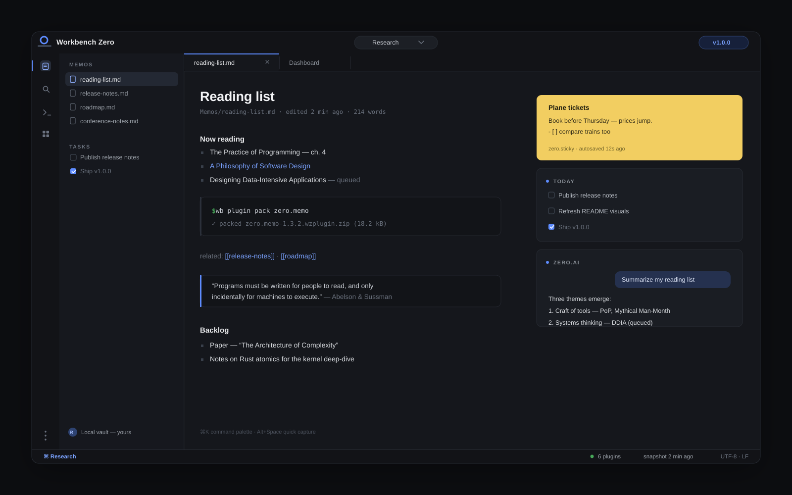
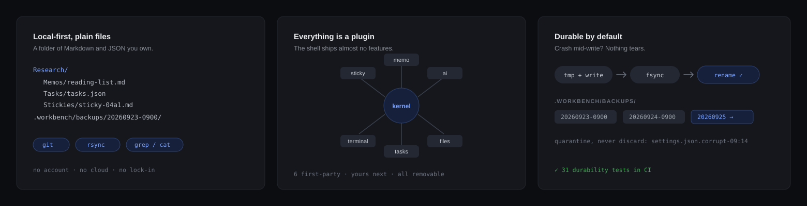
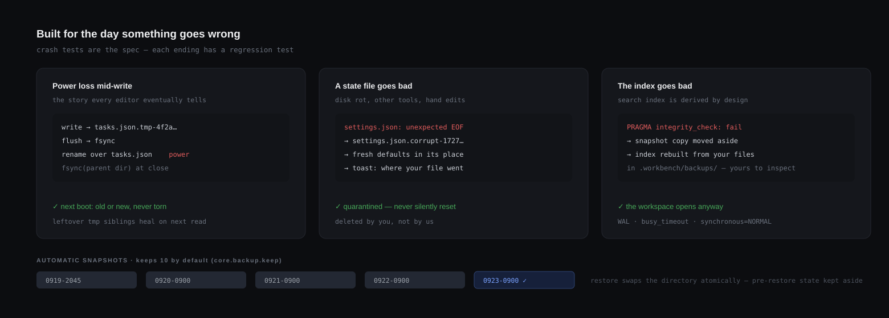
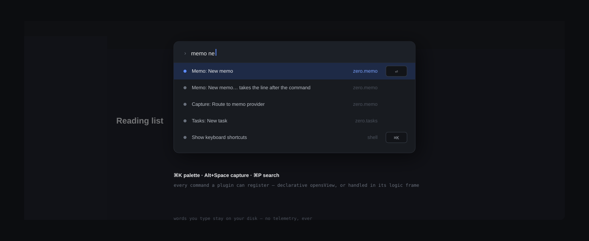
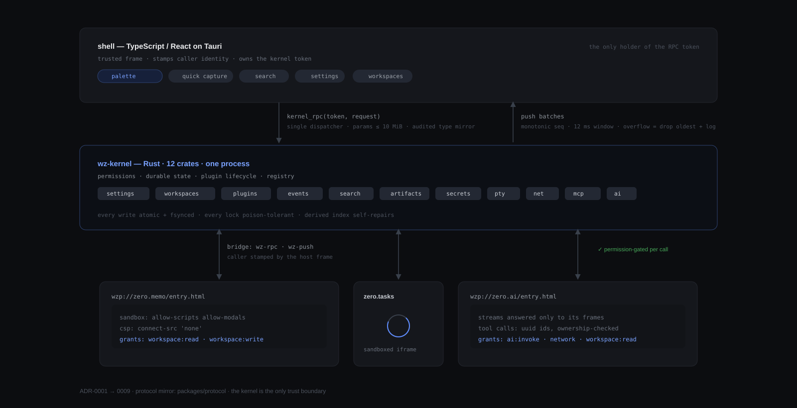
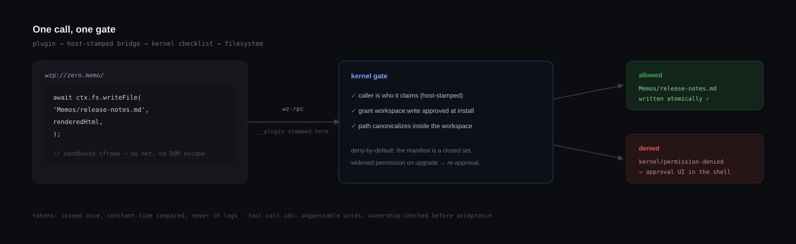

<div align="center">


# Workbench Zero

**Your workbench. From zero.**

A local-first personal workbench built entirely around plugins —\
durable enough to hold years of your data. AI included, if you want it.

[](https://github.com/yanyi010/WorkbenchZero/releases)
[](https://github.com/yanyi010/WorkbenchZero/actions/workflows/ci.yml)


</div>



<p align="center">
<sub>
⌘K palette · Alt+Space quick capture · ⌘P search — the whole shell, keyboard-first.
</sub>
</p>

---

## What it is

Notes apps die. Sync services change their terms. "Run this script" tools
scatter your work across dotfiles. Workbench Zero takes the other bet: a
**boring, inspectable core** — a directory of Markdown and JSON, coordinated
by a small Rust kernel — where every feature, including memo and AI chat, is
a sandboxed plugin you could replace tomorrow.



## Data safety

Your data lives in a plain folder you own, and the kernel treats it like a
database would: **atomic, fsynced writes**, corrupt files **quarantined
instead of reset**, a **derived index that repairs itself**, and **automatic
snapshots** under `.workbench/backups/`.



The full contract — what snapshots cover, what they deliberately don't — is
in [docs/data-safety](docs/data-safety/README.md) and
[ADR-0009](docs/adr/ADR-0009-durability-and-snapshots.md). Every guarantee
has a regression test.

## First-party plugins

| Plugin | What it does | Data it owns |
| --- | --- | --- |
| `zero.memo` | Markdown memos with front matter and full-text search | `Memos/*.md` |
| `zero.tasks` | Task list with `!prio @project #tag ~due` quick syntax | `Tasks/tasks.json` |
| `zero.sticky` | Desktop stickies, convertible to memos and tasks | `Stickies/*.md` |
| `zero.files` | Workspace file tree with rename / move / delete | your files |
| `zero.terminal` | Real terminals (xterm.js) in tabs | — |
| `zero.ai` | Streaming chat, tool calls, save-as-memo | `AI/*.md` |

Three example plugins (`community.hello-plugin`, `community.pomodoro`,
`community.quickcalc`) double as templates and test fixtures.

## Quick start

> Pre-built, signed `.deb` / `.AppImage` artifacts (with `SHA256SUMS.txt`)
> are attached to every
> [release](https://github.com/yanyi010/WorkbenchZero/releases). Linux for
> now (WebKitGTK); the bundler config is architecture-clean and a
> macOS/Windows matrix is planned.

From source (Node 22+, Rust 1.88+, `libwebkit2gtk-4.1-dev`):

```bash
git clone https://github.com/yanyi010/WorkbenchZero.git
cd WorkbenchZero
npm install
npm run build        # plugins → registry → vite
npm run dev
```

First launch asks for a workspace folder and a starter pack — that's the
whole onboarding.



## Write a plugin in 30 seconds

```bash
npm run wb -- plugin create my-first-plugin   # scaffold + manifest
npm run wb -- plugin dev my-first-plugin      # hot-reload into the running app
npm run wb -- plugin pack my-first-plugin     # → my-first-plugin.wzplugin.zip
```

A plugin is four files — `plugin.json` (manifest + declared permissions),
`entry.html`, `style.css`, `src/main.ts`:

```ts
import { definePlugin } from '@workbench-zero/plugin-sdk'

definePlugin({
  activate(ctx) {
    ctx.commands.onCommand((id) => {
      if (id !== 'example.first.hello') return undefined
      void ctx.notify.show({ title: 'Hello', body: 'Hello from my first plugin!' })
      return 'ok'
    })
  },
})
```

The command id is declared in the manifest; the palette finds it. The full
API — views, settings, workspace files, streaming network, AI tools — is in
[docs/plugin-api](docs/plugin-api/README.md); contribution points and
packaging in [docs/contribution-points](docs/contribution-points/README.md).

## Architecture

One JSON-RPC-ish dispatcher with a first-caller token; one monotonically
sequenced push inbox; sandboxed plugin iframes. That is the whole wire
surface:



Decisions are recorded in [ADRs](docs/adr/); start with
[ADR-0001](docs/adr/ADR-0001-rust-kernel-workspace.md).

## Security model



- Plugin UI runs in cross-origin `wzp://` iframes with a strict CSP
  (`connect-src 'none'`); the shell is unreachable from plugin DOM.
- Permissions are a closed, versioned set, deny-by-default; an upgrade that
  widens a grant requires re-approval.
- Shell-only RPCs cover plugin lifecycle, workspace management and
  diagnostics export; AI invocation and secret writes have their own grants.
- Secrets live in the OS keychain, with a permission-locked (`0600`) file
  fallback.

See [docs/permissions](docs/permissions/README.md) and
[SECURITY.md](SECURITY.md) — please report vulnerabilities privately.

## Stability guarantees (1.0)

Within a major version: the kernel RPC method set is append-only; the bridge
protocol stays at `apiVersion: "1"`, and plugins built for it keep working;
the on-disk workspace format only moves forward with explicit, backed-up
migrations. Details in [docs/plugin-api](docs/plugin-api/README.md#stability).

## Development

```bash
npm run typecheck && npx eslint . && npx vitest run   # TS gates
cargo fmt --all --check && cargo clippy --workspace --all-targets -- -D warnings
cargo test --workspace                                 # Rust gates
```

Every gate runs on every PR, plus MSRV (1.88), `cargo audit`, `npm audit`, a
deterministic plugin-build check, and CLI smoke tests
([CI](.github/workflows/ci.yml)). Contributing:
[CONTRIBUTING.md](CONTRIBUTING.md).

## Documentation

- [Architecture guide](docs/architecture/README.md)
- [Plugin API reference](docs/plugin-api/README.md)
- [Contribution points](docs/contribution-points/README.md)
- [Permission model](docs/permissions/README.md)
- [Data safety contract](docs/data-safety/README.md)
- [ADRs 0001–0009](docs/adr/) — every structural decision, with context

## License

[MIT](LICENSE) © Workbench Zero contributors
