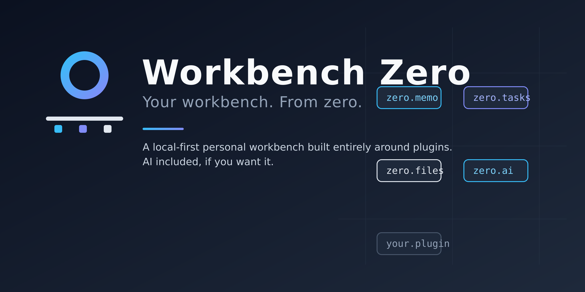

<div align="center">


# Workbench Zero

**Your workbench. From zero.**

A local-first personal workbench built entirely around plugins.\
AI included, if you want it.

[](https://github.com/yanyi010/WorkbenchZero/actions/workflows/ci.yml)
[](https://github.com/yanyi010/WorkbenchZero/actions/workflows/release.yml)




[Quick start](#quick-start) · [First-party plugins](#first-party-plugins) · [Write a plugin](#write-a-plugin-in-30-seconds) · [Architecture](#architecture) · [Security model](#security-model) · [Docs](#documentation)

</div>

---

Workbench Zero is a desktop workbench where **everything is a plugin** — notes,
tasks, files, terminals, and (optionally) AI chat. A small, fast Rust kernel
coordinates capabilities; plugins run sandboxed and permission-scoped; all of
your data lives in a folder you own.

- **Local-first.** Your workspace is a plain directory of Markdown and JSON. No
  accounts, no cloud, no lock-in. Back it up with `rsync`, version it with
  `git`, inspect it with `cat`.
- **Everything is a plugin.** The shell ships almost no features. Memo, Tasks,
  Files, Terminal — all plugins, all removable, all replaceable by yours.
- **AI included, if you want it.** The `zero.ai` plugin talks to any
  OpenAI-compatible endpoint you configure. No telemetry, no bundled API keys,
  and the plugin is as optional as every other one.
- **Deny-by-default permissions.** Plugins declare capabilities
  (`workspace:read`, `process:spawn`, …); the kernel enforces the closed set.
- **Sandboxed by construction.** Plugin UI runs in cross-origin `wzp://`
  iframes with `connect-src 'none'` — no network, no DOM access to the shell.

## First-party plugins

| Plugin | What it does | Data it owns |
| --- | --- | --- |
| `zero.memo` | Markdown memos with front matter, wiki-style search | `Memos/*.md` |
| `zero.tasks` | Task list with `!prio @project #tag ~due` quick syntax | `Tasks/tasks.json` |
| `zero.sticky` | Desktop stickies, convertible to memos and tasks | `Stickies/*.md` |
| `zero.files` | Workspace file tree with rename / move / delete | your files |
| `zero.terminal` | Real terminals (xterm.js) in tabs | — |
| `zero.ai` | Streaming chat, tool calls, save-as-memo | `AI/*.md` |

Three example plugins (`community.hello-plugin`, `community.pomodoro`,
`community.quickcalc`) double as templates and test fixtures.

## Quick start

> Pre-built `.deb` / `.AppImage` artifacts are attached to every
> [release](https://github.com/yanyi010/WorkbenchZero/releases). Linux only
> for now (WebKitGTK); macOS and Windows build paths are wired but untested.

From source (Node 22+, Rust 1.85+, `libwebkit2gtk-4.1-dev`):

```bash
git clone https://github.com/yanyi010/WorkbenchZero.git
cd WorkbenchZero
npm install
npm run build        # plugins → registry → vite
npm run dev          # or: cargo tauri dev
```

First launch asks for a workspace folder and a starter pack — that's the whole
onboarding. `Ctrl+K` opens the command palette, `Alt+Space` is quick capture,
`Ctrl+P` searches the workspace.

## Write a plugin in 30 seconds

```bash
npx wb create my-first-plugin   # scaffold
npx wb dev my-first-plugin      # hot-reload into the running app
npx wb pack my-first-plugin     # → my-first-plugin.wzplugin.zip
```

A plugin is four files: `plugin.json` (manifest + permissions), `entry.html`,
`style.css`, and `src/main.ts`:

```ts
import { definePlugin } from '@workbench-zero/plugin-sdk'

export default definePlugin({
  commands: [{
    id: 'hello',
    title: 'Say hello',
    handler: ctx => ctx.ui.notify('Hello from my first plugin!'),
  }],
})
```

Full API — UI surfaces, settings, workspace files, events, AI tools — is
documented in [`docs/plugin-api`](docs/plugin-api/README.md). Contribution
points, permissions and packaging are covered in
[`docs/contribution-points`](docs/contribution-points/README.md) and
[`docs/permissions`](docs/permissions/README.md).

## Architecture

```
┌────────────────────────────────────────────────────────┐
│ Workbench Zero shell (TypeScript / React, Tauri webview)│
│   palette · quick capture · search · settings · welcome │
└──────────────▲─────────────────────────▲───────────────┘
       kernel_rpc(token, payload)   window.__kernelInbox(batch)
┌──────────────┴─────────────────────────┴───────────────┐
│ wz-kernel (Rust): settings · workspaces · commands ·    │
│ events · search · artifacts · secrets · plugin runtime  │
└──────────────▲─────────────────────────▲───────────────┘
   single JSON-RPC-ish dispatcher   batched push (seq)
┌──────────────┴─────────────────────────┴───────────────┐
│ plugin iframes (wzp://<id>/…, cross-origin sandbox)    │
│   zero.memo · zero.tasks · zero.files · zero.terminal … │
└─────────────────────────────────────────────────────────┘
```

One command (`kernel_rpc`), a first-caller token, an audited TypeScript
protocol mirror, and a batched inbox — the whole wire surface. Decisions are
recorded in [ADRs](docs/adr/); start with
[ADR-0001](docs/adr/ADR-0001-rust-kernel-workspace.md).

## Security model

- Plugins are cross-origin iframes served from `wzp://` with a strict CSP
  (`connect-src 'none'`); the shell is unreachable from plugin DOM.
- Permissions are a closed, versioned set, deny-by-default, granted at install
  time (see [docs/permissions](docs/permissions/README.md)).
- Secrets live in the OS keychain (with an encrypted-at-rest file fallback).
- Paths are contained: no `..`, no absolute escapes, no symlink tricks —
  enforced in Rust, covered by tests.

## Development

```bash
npm run typecheck && npx eslint . && npx vitest run   # TS gates
cargo fmt --all --check && cargo clippy --workspace --all-targets
cargo test --workspace                                 # Rust gates
```

All gates run on every PR ([CI](.github/workflows/ci.yml)). See
[CONTRIBUTING.md](CONTRIBUTING.md) for the full workflow, and
[docs/architecture](docs/architecture/README.md) for the guided tour.

## Documentation

- [Architecture guide](docs/architecture/README.md)
- [Plugin API reference](docs/plugin-api/README.md)
- [Contribution points](docs/contribution-points/README.md)
- [Permission model](docs/permissions/README.md)
- [ADRs 0001–0008](docs/adr/) — every structural decision, with context

## License

[MIT](LICENSE) © Workbench Zero contributors
